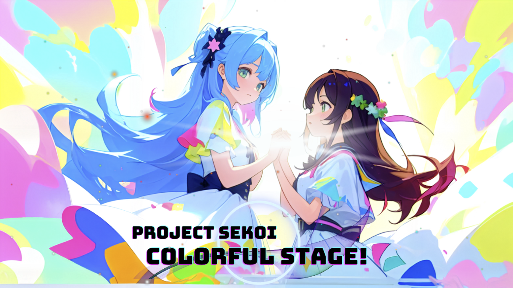
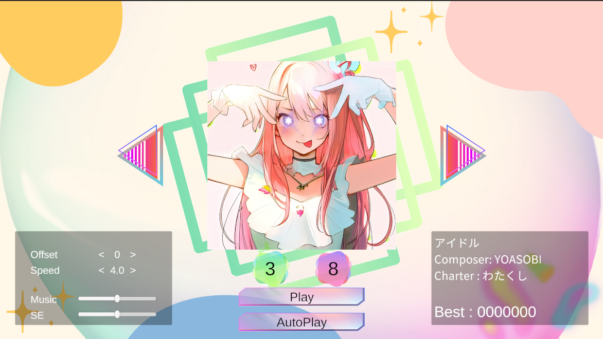
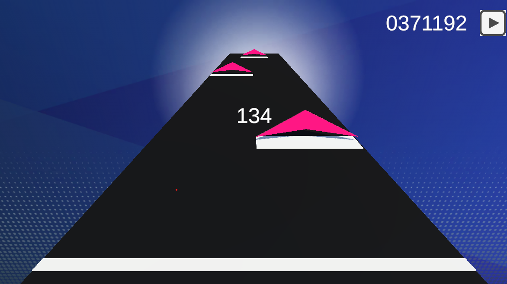
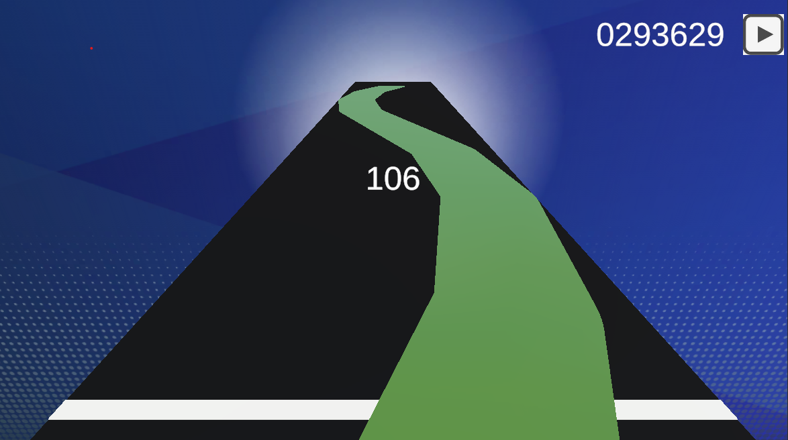
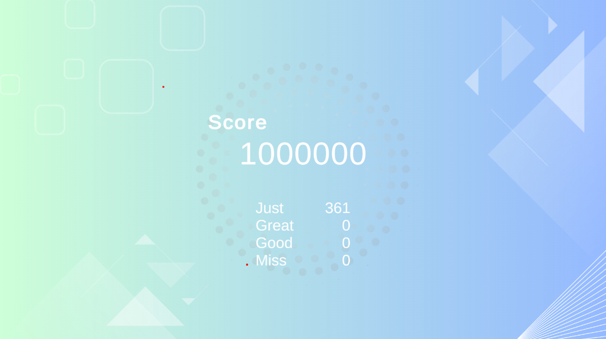

# プロジェクトセコイ
プロセカを作(りたか)った

## Features
- タイトル画面
- 曲選択画面
  - 難易度選択
  - オフセット，スピードの調整
- ゲーム
  - タップ，フリック，ホールド(スライド)
  - 3段階の判定とミス
- リザルト画面

## Screenshots

## Demo
TODO

## Credit
- エンジン - Unity (2021.3.23f1) : https://unity.com/
- 素材生成 : Stable Diffusion
- 素材作成 : https://www.canva.com/
- 譜面のアイデア : https://github.com/setchi/NoteEditor
